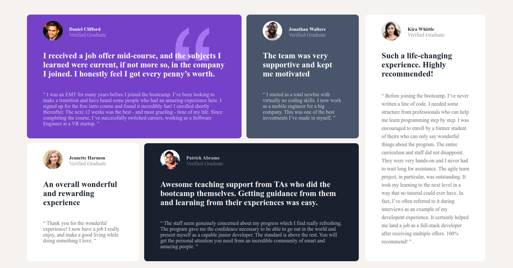
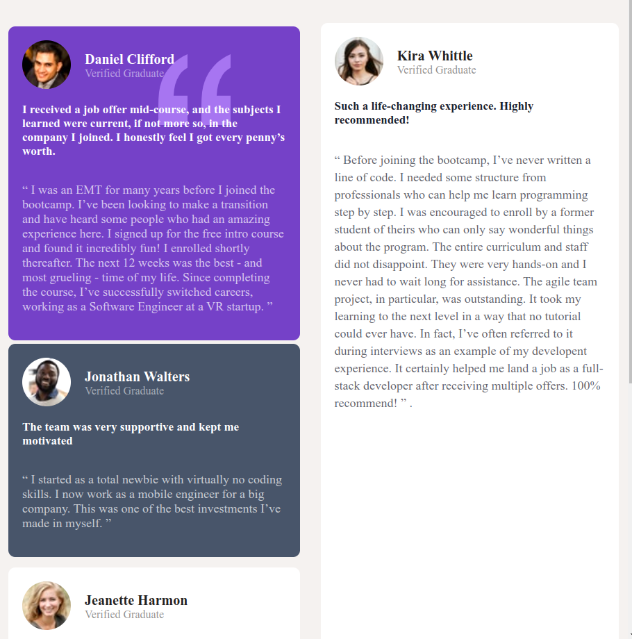

## Assignemnt 1 User interface 

## Assigbnement 2 User interfaces
1. First Design

2. Design 2

## Assignment 3 User Interfaces
1. First Design

2. Design 2 
Working on grids . Improved on the Grid design after learning the css grid

Also added some Responsiveness on the design for different screen sizes 
    
This is for a screen-Size of around 1200px 

This is for screenSizes of around 768px
